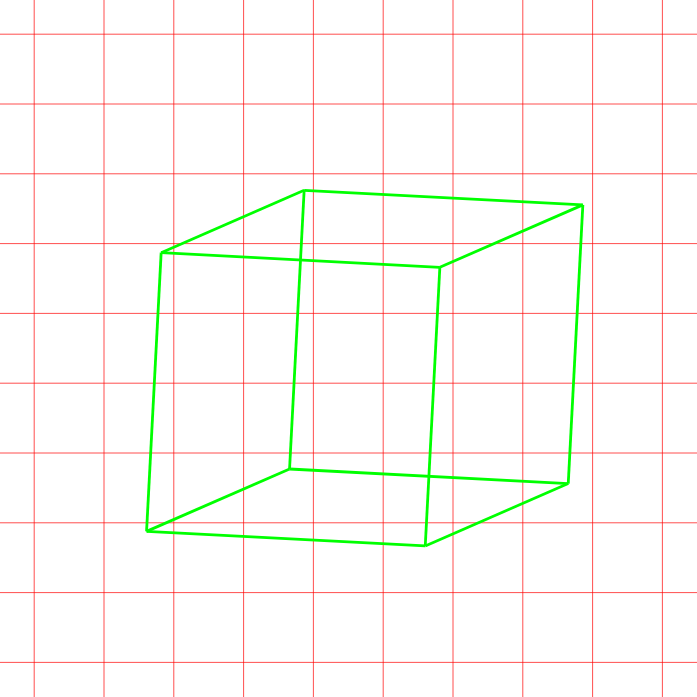
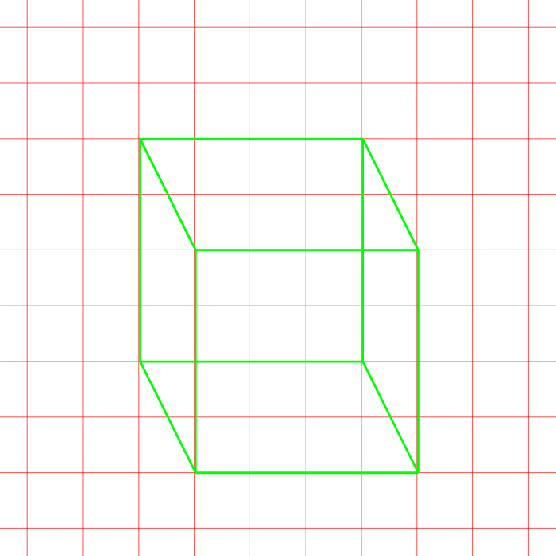

# Assignment: Rotate me

*PLEASE READ THIS **ENTIRE** DOCUMENT FIRST*

* [the assignment](#the-assignment)
* [submitting-your-work](#submitting-your-work)

## The assignment

Open the lined cube file

* Add a hover function that rotates the cube 90 degrees
* Add a transition with a duration of your choice to the rotation
* After completing the rotation function, add a translate function that moves the cube to a different position on the gird, make sure it moves to an aligned position
* Add a transition with a duration of your choice to the translation

Tip: Too hard to hover over the cube? Place something transparent in the background

## Submitting your work
Create a new branch called **gh-pages** and upload your local work into this branch. Submit a new **pull request** and make sure to put the (working) **GitHub Pages URL** in the comment section. 
